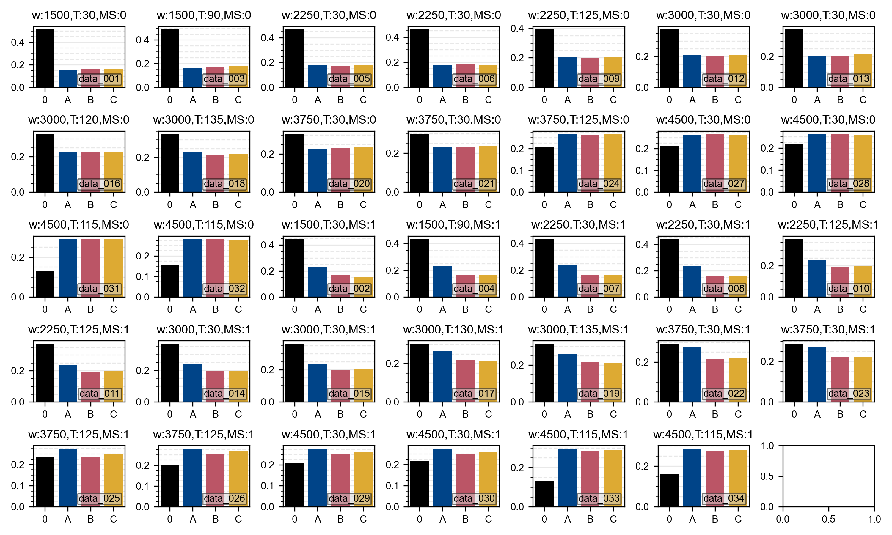
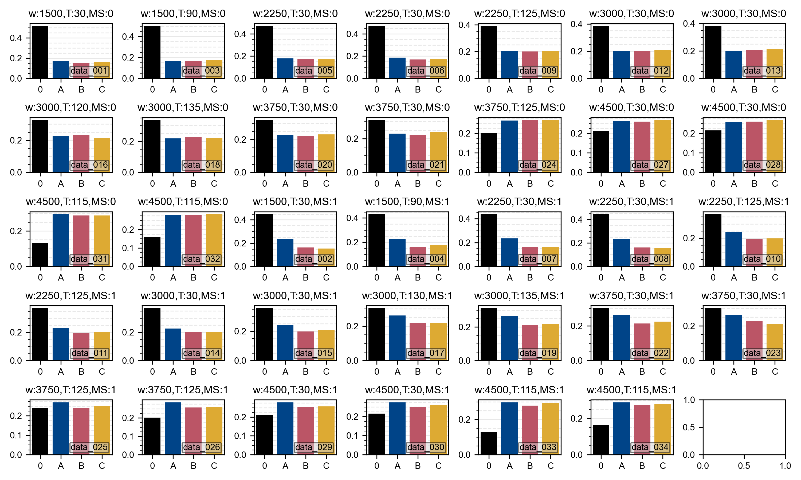
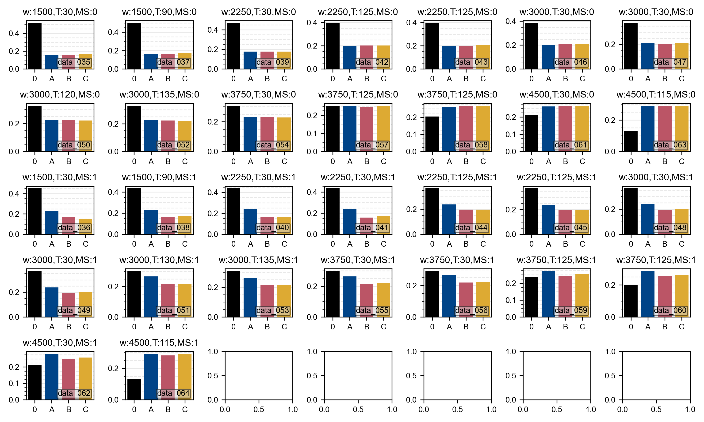
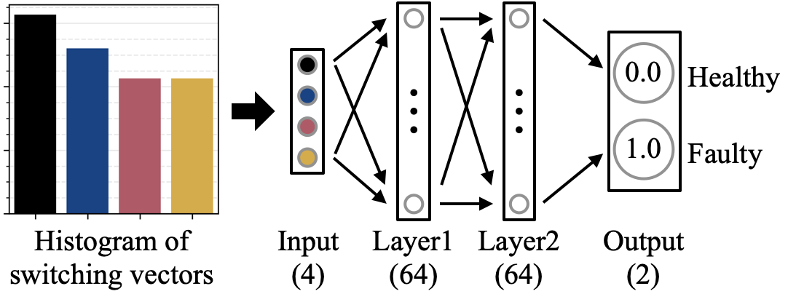
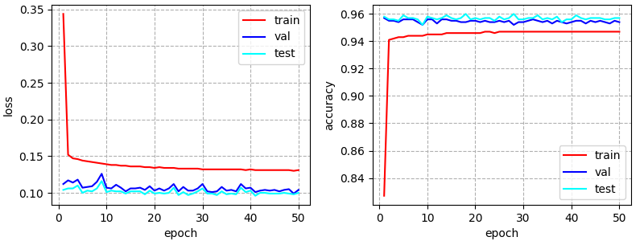
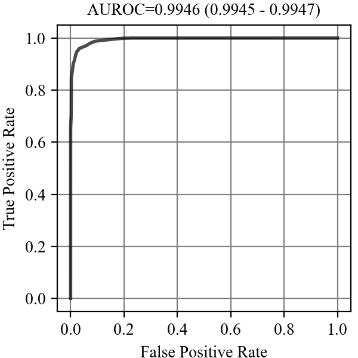

# Inter-turn Short Circuit Fault (ISCF) Detection

This repository is the official implementation of [Neural Networks Detect Inter-Turn Short Circuit Faults Using Inverter Switching Statistics](https://doi.org/10.36227/techrxiv.19145444.v1). 

This study developed neural network models using inverter switching statistics to detect the inter-turn short circuit fault (ISCF) of an induction machine (IM). The IM was driven by an inverter with a model predictive control algorithm. The method was non-invasive, and it did not require any additional sensors.

 
Folder structure:

```console
ISCF Detection
├── _images
├── data
├── dataset
├── healthy_vs_faulty_machine_classification__mlp
├── healthy_vs_faulty_machine_classification__cnn
├── healthy_vs_faulty_machine_classification__rnn
├── README.md
└── requirements.txt
```

We train and test neural network models of multi-layer perceptron (MLP), convolutional neural network (CNN), and recurrent neural network (RNN). The structure of the code is the same for all. Here, we will go through only the MLP code, yet it applies to all.

We will explain the following steps one-by-one:

* [Required Python Packages](#required-python-packages)
* [Inverter Switching Vectors Data](#inverter-switching-vectors-data)
* [Healthy vs. Faulty Machine Classification](#healthy-vs-faulty-machine-classification)

## Required Python Packages

All the experiments were run in a virtual environment created with pip.

To install requirements:

```console
pip install -r requirements.txt
```

## Inverter Switching Vectors Data

Switching vectors of an inverter with model predictive control were collected for different conditions of an induction machine in an experimental setup explained in [Sahin et al.](https://ieeexplore.ieee.org/abstract/document/9310277)

The "data" folder stored the collected data. 

```console
data
├── labels.txt
├── data_001.txt
├── data_002.txt
├── data_003.txt
...
```

For each different set of conditions, the switching vectors (0-vectors (v0 − v7), phase A vectors (v1 − v4), phase B vectors (v3 − v6), and phase C vectors (v2 − v5)) were stored in a separate text file (e.g. "data_001.txt").

```console
5
0
0
...
```

For each data series, the number of switching vectors (N), speed (w), torque (T), measured electrical frequency (f_e), machine status (MS - 0: Healthy and 1: Faulty), and phase status (PS_A, PS_B, and PS_C - 0: Healthy and 1: Faulty) were given in "labels.txt"

```console
# file_id   N   w (rpm) T (x10^-2 Nm)   f_e (Hz)    MS  PS_A    PS_B    PS_C
data_001    22000   1500    30  25.5    0   0   0   0
data_002    22000   1500    30  25.5    1   1   0   0
data_003    22000   1500    90  28.0    0   0   0   0
...
```

The data series were segregated into training and test sets. The data series in each set were listed in files inside the "dataset folder".

```console
dataset
├── train_filelist.txt
└── test_filelist.txt
```

Histograms of switching vectors in data series used to create the samples in the training, validation, and test sets. While aggregated 0-vectors is represented as 0, aggregated active vectors are represented as A, B and C. For each data series, id, speed (rpm), torque (×10^-2 N·m), and MS (0: Healthy, 1:Faulty) are also given.

The training set:



The validation set:



The test set:




## Healthy vs. Faulty Machine Classification

We formulate ISCF detection as a classification problem using inverter switching statistics. The model accepts a histogram of inverter switching statistics at the input and predicts the machine’s status (healthy or faulty) at the output.



Initial content of the folder:

```console
healthy_vs_faulty_machine_classification
├── dataset.py
├── dataset_test.py
├── model.py
├── train.py
├── plot_loss_acc.py
├── test.py
├── collect_statistics.py
├── saved_models
├── loss_data
└── test_metrics
```

To train the model:

```console
python train.py
```

The model weights were regularly saved into the "saved_models" folder.

```console
saved_models
├── state_dict__2022_01_21__04_38_12__10.pth
├── state_dict__2022_01_21__04_38_12__20.pth
├── state_dict__2022_01_21__04_38_12__30.pth
...
```

The loss and accuracy values calculated on the training, validation, and test sets were stored into the "loss_data" folder.

```console
loss_data
└── step_loss_acc_metrics__2022_01_21__04_38_12.txt
```

To plot loss and accuracy curves over the epochs:

```console
python plot_loss_acc.py loss_data/step_loss_acc_metrics__2022_01_21__04_38_12.txt
```




To check the performance of the trained model on the test set:

```console
python test.py --init_model_file saved_models/state_dict__2022_01_21__04_38_12__best_49.pth
```

The predictions of the samples created from a data series were stored under the corresponding data series folder inside the "test_metrics" folder.

```console
test_metrics
└── 2022_01_21__04_38_12__best_49
    └── test
        ├── data_035
        │   └── predictions_data_035.txt
        ├── data_036
        │   └── predictions_data_036.txt
        ├── data_037
        │   └── predictions_data_037.txt
        ...
```

Sample predictions were then processed to obtain statistics at the sample-level and data series-level:

```console
python collect_statistics.py --data_folder_path test_metrics/2022_01_21__04_38_12__best_49/test
```

Sample predictions were plotted for each data series inside the corresponding folder (e.g. "sample_predictions__data_035.png"). Sample-level and data series-level statistics were saved under the main "test" folder.

```console
test_metrics
└── 2022_01_21__04_38_12__best_49
    └── test
        ├── data_035
        │   ├── predictions_data_035.txt
        │   ├── sample_predictions__data_035.pdf
        │   └── sample_predictions__data_035.png
        ├── data_036
        │   ├── predictions_data_036.txt
        │   ├── sample_predictions__data_036.pdf
        │   └── sample_predictions__data_036.png
        ...
        ├── data_series_level_cm.txt
        ├── data_series_level_cm_normalized.png
        ├── data_series_level_cm_unnormalized.png
        ├── data_series_level_roc.pdf
        ├── data_series_level_roc.png
        ├── data_series_level_statistics.txt
        ├── data_series_predictions.txt
        ├── sample_level_cm.txt
        ├── sample_level_cm_normalized.png
        ├── sample_level_cm_unnormalized.png
        ├── sample_level_roc.pdf
        ├── sample_level_roc.png
        └── sample_level_statistics.txt
```

Sample-level receiver operating chracteristics curve ("sample_level_roc.png"):



Sample-level statistics ("sample_level_statistics.txt"):

```console
# acc   precision   recall  fscore  auroc   auroc_lower auroc_upper
0.9570  0.9489  0.9717  0.9602  0.9946  0.9945  0.9947
```

Data series-level statistics ("data_series_level_statistics.txt"):

```console
# acc   precision   recall  fscore  auroc   auroc_lower auroc_upper
1.0000  1.0000  1.0000  1.0000  1.0000  1.0000  1.0000
```


